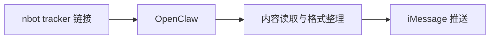

# nbot tracker OpenClaw

这是我为 OpenClaw 整理并打包的一个 skill，用来把指定 `nbot tracker` 的内容推送到我的 iMessage。这个流程已经实际跑通。

## 项目简介

这个项目的起点很直接：我希望 OpenClaw 能够持续读取我提供的 `nbot tracker` 内容，并把更新结果推送到我自己的 iMessage 上。

我先把这个需求描述清楚，并把整条流程跑通；在流程验证完成之后，再把它整理成一个可以直接分享给别人的 skill 包。仓库中的 `nbot-tracker.skill`，就是这个项目最终的交付物。

## 这个 skill 做什么

它的核心流程可以概括为四步：

1. 接收我提供的 `nbot tracker` 链接
2. 读取 tracker 中的更新内容
3. 按预设格式整理输出
4. 通过 OpenClaw 定时推送到 iMessage

## 当前已经跑通的场景

- 输入来源：`nbot tracker`
- 调度与执行：OpenClaw
- 消息目标：iMessage
- 当前状态：从 tracker 到 iMessage 的完整推送流程已经验证通过

## 流程示意

## 仓库内容

这个仓库提供的是可直接分发的 skill 包，以及便于阅读的补充说明。

- `nbot-tracker.skill`：最终可导入、可分享的 skill 包
- `SKILL.md`：skill 的说明文件
- `scripts/setup-tracker.sh`：相关脚本
- `references/nbot-format.md`：内容格式说明
- `references/platform-setup.md`：平台配置参考
- [docs/package-overview.md](docs/package-overview.md)：补充说明文档

## 使用方式

1. 将 `nbot-tracker.skill` 导入 OpenClaw
2. 提供需要跟踪的 `nbot tracker` 链接
3. 配置 OpenClaw 的消息通道，并确认 iMessage 可用
4. 运行流程或设置定时任务
5. 等待内容推送到指定的 iMessage

## 我的工作

- 明确需求：定义“tracker 内容推送到 iMessage”这个目标场景
- 跑通流程：完成从 tracker 到消息送达的验证
- 整理交付：把整套流程打包成可复用、可分享的 skill

## 当前限制

- 当前验证通过的主要场景是 iMessage 推送
- skill 的运行依赖 OpenClaw 环境和消息通道配置
- 仓库里不包含运行时凭证或个人配置
- 如果要扩展到其他消息通道，仍然需要在 OpenClaw 侧做相应配置

## 补充说明

如果只想快速了解这个 skill 包里包含哪些文件，可以继续看 [docs/package-overview.md](docs/package-overview.md)。

## License

本项目采用 MIT License。
