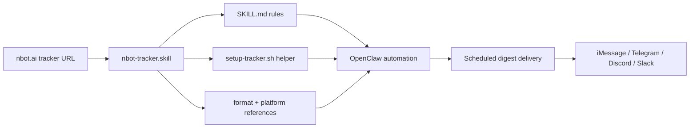

# NBot Tracker Skill Package

A packaged OpenClaw skill for fetching AI Industry Pulse updates from `nbot.ai` trackers and delivering them to messaging platforms.

## 这个项目是什么 / What This Package Is

这个仓库保存的是一个打包后的 `.skill` 产物，名称为 `nbot-tracker.skill`。
根据包内文档，它的目标是从 `nbot.ai` 的 tracker 或 curator 页面抓取最近 24 小时内的更新内容，并通过 OpenClaw 的消息通道发送到 iMessage、Telegram、Discord、Slack 等平台。

This repository stores a packaged `.skill` artifact called `nbot-tracker.skill`.
Based on the files inside the package, its purpose is to fetch recent updates from `nbot.ai` tracker or curator pages and deliver them through OpenClaw-compatible messaging channels such as iMessage, Telegram, Discord, and Slack.

## 它解决什么问题 / Problem It Solves

这个技能包面向“想定时接收 AI 行业动态摘要”的场景，把三件事串在一起：

- 接收一个 `nbot.ai` tracker URL
- 规范化抓取与消息格式
- 把内容按定时任务发送到目标平台

This skill package is designed for users who want scheduled AI news digests.
It connects three steps into one workflow:

- accept an `nbot.ai` tracker URL
- standardize the extraction and message format
- send updates to a target platform on a schedule

## 适用对象 / Who It Is For

- 使用 OpenClaw 自动化工作流的人
- 想把 `nbot.ai` tracker 更新推送到消息平台的人
- 希望把摘要格式固定下来的个人用户或小团队

- OpenClaw users who automate recurring workflows
- Users who want `nbot.ai` tracker updates delivered to messaging platforms
- Individuals or small teams who want a consistent digest format

## 当前仓库为什么只有 `.skill` / Why The Repo Stores A Packaged Artifact

这个仓库当前以打包产物为主，而不是以展开后的源码树为主。
这样做更像“可分发的技能包”而不是“源码项目”，对实际安装和迁移更直接，但对招聘方或协作者阅读不够友好。
所以这次补充了 README 和说明文档，专门把包里的能力、结构和限制讲清楚。

This repository currently prioritizes the packaged artifact instead of an unpacked source tree.
That makes it easier to distribute as a portable skill package, but harder for reviewers to understand at a glance.
The added README and documentation make the package easier to review without changing the artifact-first storage approach.

## 已知包内结构 / Observed Package Structure

从 `nbot-tracker.skill` 这个 zip 包中可以直接观察到以下文件：

- `SKILL.md`
- `scripts/setup-tracker.sh`
- `references/nbot-format.md`
- `references/platform-setup.md`

The following files are directly visible inside `nbot-tracker.skill`:

- `SKILL.md`
- `scripts/setup-tracker.sh`
- `references/nbot-format.md`
- `references/platform-setup.md`

## 包内职责概览 / Package Responsibilities

- `SKILL.md`：定义技能用途、输入要求、消息格式、平台支持和工作流
- `scripts/setup-tracker.sh`：提供基础的参数接收和 cron 时间转换示例
- `references/nbot-format.md`：定义摘要编号、标题、项目符号、链接和时间过滤规则
- `references/platform-setup.md`：整理不同消息平台的配置要求与目标格式

- `SKILL.md`: defines the skill purpose, inputs, message format, platform support, and workflow
- `scripts/setup-tracker.sh`: provides basic argument handling and cron schedule conversion examples
- `references/nbot-format.md`: documents digest numbering, titles, bullets, links, and time filtering rules
- `references/platform-setup.md`: summarizes platform-specific configuration requirements and target formats

## 流程图 / Workflow

## 如何使用 / How To Use

1. 准备一个 `nbot.ai` tracker 或 curator URL。
2. 选择推送时间，例如 `8:00`、`7:30` 或其他周期表达。
3. 选择目标平台和接收对象。
4. 确保 OpenClaw 侧已经配置好对应的消息通道。
5. 根据 `SKILL.md` 和参考文档，把这个 `.skill` 包接入你的自动化流程。

1. Prepare an `nbot.ai` tracker or curator URL.
2. Choose a delivery time such as `8:00`, `7:30`, or another schedule.
3. Choose the target platform and recipient.
4. Make sure the matching messaging channel is configured in OpenClaw.
5. Use `SKILL.md` and the reference files to connect this `.skill` package into your automation flow.

## 环境要求 / Requirements

- 能运行 OpenClaw 自动化流程的环境
- 可用的消息通道配置
- 对应平台的凭证或 bot 配置
- 支持定时任务的运行环境

- An environment capable of running OpenClaw automations
- A configured messaging channel
- Platform credentials or bot configuration where needed
- A runtime environment that supports scheduled jobs

## 当前限制 / Current Limitations

- 当前仓库主内容是打包产物，不是展开后的源码目录
- `scripts/setup-tracker.sh` 当前只展示了基础参数解析和 cron 推导，不是完整部署器
- 实际消息发送依赖 OpenClaw 和平台侧配置
- 仓库本身不包含完整的 bot token、channel config 或运行时 secrets

- The repository currently centers on a packaged artifact rather than an unpacked source tree
- `scripts/setup-tracker.sh` currently demonstrates basic argument parsing and cron derivation rather than full deployment
- Actual message delivery depends on OpenClaw and platform-side configuration
- The repository does not include runtime secrets such as bot tokens or channel credentials

## 后续可扩展方向 / Possible Next Steps

- 补充一个解包后的源码镜像目录，提升可读性
- 增加示例配置和测试用输入
- 为不同平台增加更明确的 setup walkthrough
- 增加一个最小可复现的 OpenClaw 集成示例

- Add an unpacked source mirror for better readability
- Include sample configurations and example inputs
- Add clearer setup walkthroughs for each messaging platform
- Provide a minimal OpenClaw integration example

## 更多说明 / More Context

更详细的仓库包装说明见 [docs/package-overview.md](docs/package-overview.md)。

For more context on why the repository is organized around a packaged artifact, see [docs/package-overview.md](docs/package-overview.md).

## License

This project is released under the MIT License.
